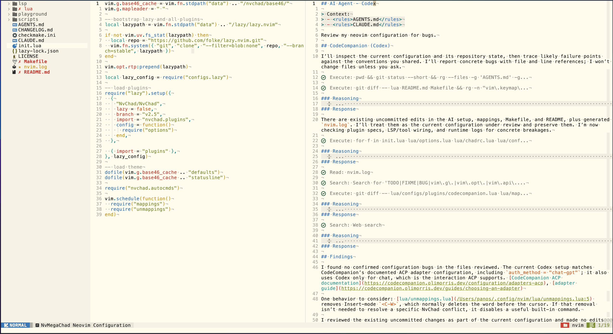
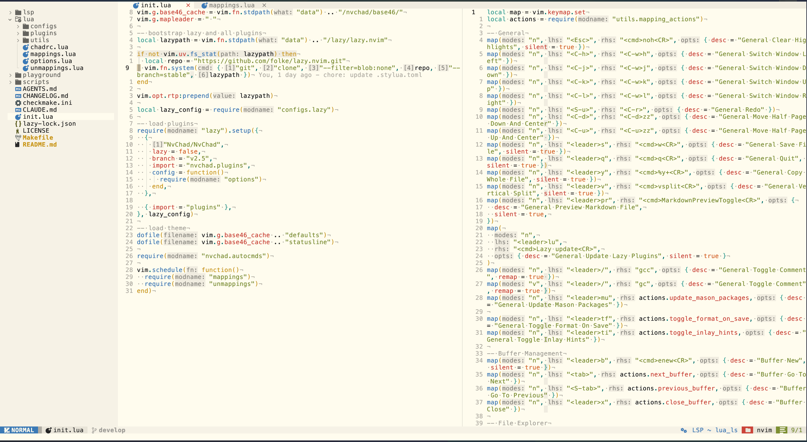
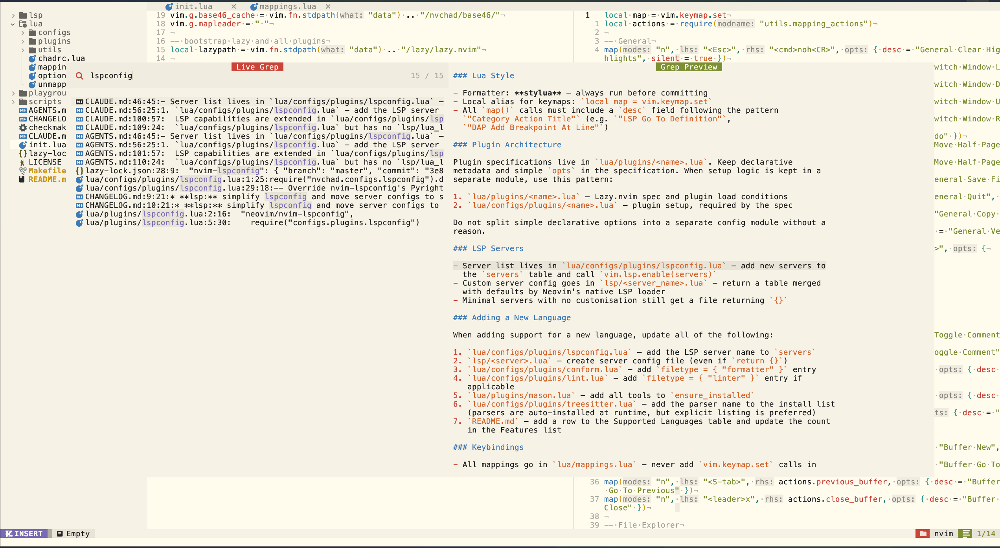
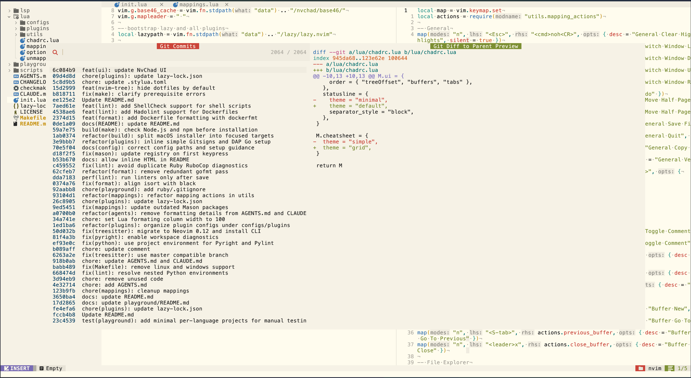
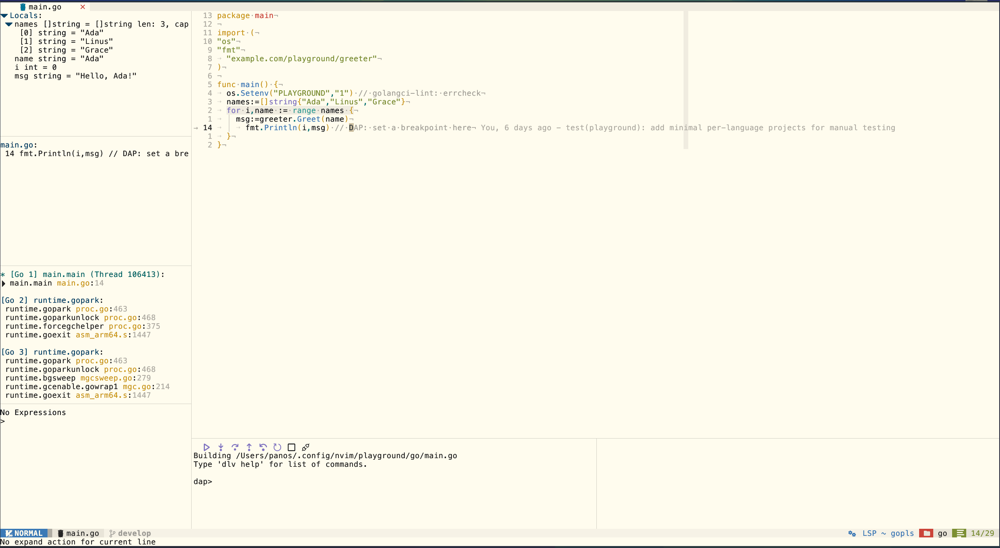
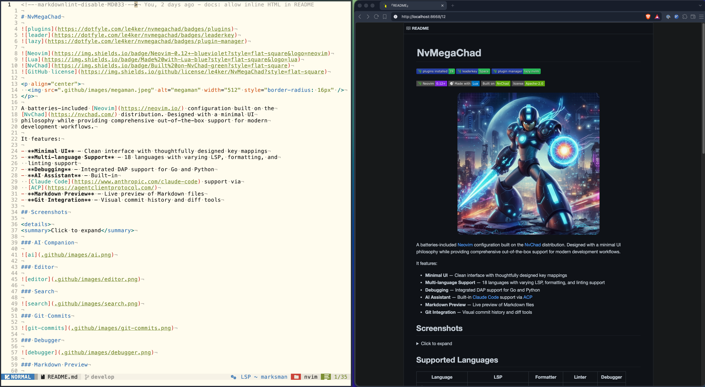
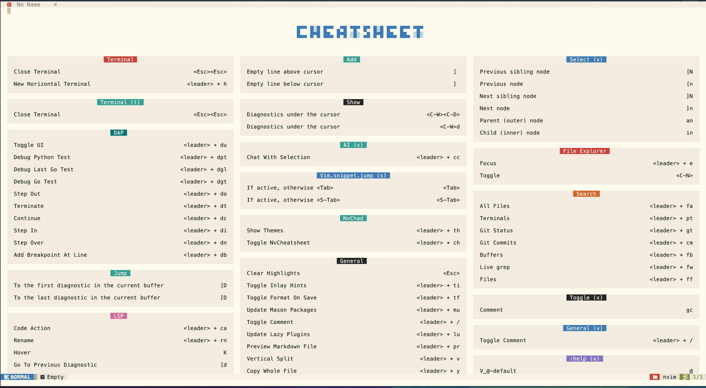

<!-- markdownlint-disable MD033 -->

# NvMegaChad


<p align="center">
  
</p>

A batteries-included [Neovim](https://neovim.io/) configuration built on the
[NvChad](https://nvchad.com/) distribution. Designed with a minimal UI
philosophy while providing comprehensive out-of-the-box support for modern
development workflows.

It features:

- **Minimal UI** — Clean interface with thoughtfully designed key mappings
- **Multi-language Support** — 18 languages with varying LSP, formatting, and
  linting support
- **Debugging** — Integrated DAP support for Go and Python
- **AI Agent** — Built-in [OpenAI Codex](https://openai.com/codex/) support via
  [ACP](https://agentclientprotocol.com/)
- **Markdown Preview** — Live preview of Markdown files
- **Git Integration** — Visual commit history and diff tools

## Screenshots

<details>
<summary>Click to expand</summary>

### AI Agent



### Editor



### Search



### Git Commits



### Debugger



### Markdown Preview



### Cheatsheet



</details>

## Supported Languages

| Language              | LSP                                                                                                                                      | Formatter                                                                        | Linter                                                     | Debugger                                        |
| --------------------- | ---------------------------------------------------------------------------------------------------------------------------------------- | -------------------------------------------------------------------------------- | ---------------------------------------------------------- | ----------------------------------------------- |
| Go                    | [gopls](https://pkg.go.dev/golang.org/x/tools/gopls)                                                                                     | goimports                                                                        | [golangci-lint](https://golangci-lint.run/)                | [delve](https://github.com/go-delve/delve)      |
| Python                | [pyright](https://github.com/microsoft/pyright)                                                                                          | [black](https://github.com/psf/black), [isort](https://github.com/PyCQA/isort)   | [pylint](https://pylint.org/)                              | [debugpy](https://github.com/microsoft/debugpy) |
| C/C++                 | [clangd](https://clangd.llvm.org)                                                                                                        | [clang-format](https://www.kernel.org/doc/html/latest/process/clang-format.html) | —                                                          | —                                               |
| Lua                   | [lua-language-server](https://github.com/LuaLS/lua-language-server)                                                                      | [stylua](https://github.com/JohnnyMorganz/StyLua)                                | —                                                          | —                                               |
| Ruby                  | [ruby-lsp](https://github.com/Shopify/ruby-lsp)                                                                                          | [rubocop](https://github.com/rubocop/rubocop)                                    | [rubocop](https://github.com/rubocop/rubocop)              | —                                               |
| TypeScript/JavaScript | [typescript-language-server](https://github.com/typescript-language-server/typescript-language-server)                                   | [prettier](https://github.com/prettier/prettier)                                 | —                                                          | —                                               |
| HTML/CSS/SCSS         | [html-lsp](https://github.com/microsoft/vscode-html-languageservice), [css-lsp](https://github.com/microsoft/vscode-css-languageservice) | [prettier](https://github.com/prettier/prettier)                                 | —                                                          | —                                               |
| JSON                  | [json-language-server](https://github.com/microsoft/vscode-langservers-extracted)                                                        | [prettier](https://github.com/prettier/prettier)                                 | —                                                          | —                                               |
| GraphQL               | —                                                                                                                                        | [prettier](https://github.com/prettier/prettier)                                 | —                                                          | —                                               |
| YAML                  | [yaml-language-server](https://github.com/redhat-developer/yaml-language-server)                                                         | [prettier](https://github.com/prettier/prettier)                                 | —                                                          | —                                               |
| Markdown              | [marksman](https://github.com/artempyanykh/marksman)                                                                                     | [prettier](https://github.com/prettier/prettier)                                 | [markdownlint](https://github.com/DavidAnson/markdownlint) | —                                               |
| Bash                  | [bash-language-server](https://github.com/bash-lsp/bash-language-server)                                                                 | [shfmt](https://github.com/mvdan/sh)                                             | [ShellCheck](https://github.com/koalaman/shellcheck)       | —                                               |
| Dockerfile            | [dockerfile-language-server](https://github.com/rcjsuen/dockerfile-language-server-nodejs)                                               | [dockerfmt](https://github.com/reteps/dockerfmt)                                 | [hadolint](https://github.com/hadolint/hadolint)           | —                                               |
| Terraform             | [terraform-ls](https://github.com/hashicorp/terraform-ls)                                                                                | [terraform_fmt](https://developer.hashicorp.com/terraform/cli/commands/fmt)      | [tflint](https://github.com/terraform-linters/tflint)      | —                                               |
| TOML                  | [taplo](https://taplo.tamasfe.dev/)                                                                                                      | [taplo](https://taplo.tamasfe.dev/)                                              | —                                                          | —                                               |
| Makefile              | —                                                                                                                                        | [bake](https://github.com/nicholasgasior/bake)                                   | [checkmake](https://github.com/mrtazz/checkmake)           | —                                               |
| Vimscript             | [vim-language-server](https://github.com/iamcco/vim-language-server)                                                                     | —                                                                                | —                                                          | —                                               |
| SQL                   | —                                                                                                                                        | [sql-formatter](https://github.com/sql-formatter-org/sql-formatter)              | —                                                          | —                                               |

## Installation

### Requirements

| Dependency                                                      | Version | Notes                                |
| --------------------------------------------------------------- | ------- | ------------------------------------ |
| [Neovim](https://github.com/neovim/neovim/releases/tag/v0.12.0) | 0.12.0+ | Required                             |
| [Nerd Font](https://www.nerdfonts.com/)                         | Any     | Hack Nerd Font recommended           |
| [Ripgrep](https://github.com/BurntSushi/ripgrep)                | Latest  | For fuzzy finding                    |
| [Node.js/npm](https://nodejs.org/)                              | Latest  | Required by Markdown Preview and ACP |
| [Codex ACP](https://github.com/agentclientprotocol/codex-acp)   | Latest  | Optional, for AI agent               |
| [Terraform](https://www.terraform.io/)                          | Latest  | Optional, for Terraform support      |

### Quick Install

```sh
# Backup and remove existing config
mv ~/.config/nvim ~/.config/nvim.bak
mv ~/.local/share/nvim ~/.local/share/nvim.bak

# Clone and install
git clone https://github.com/le4ker/NvMegaChad ~/.config/nvim
cd ~/.config/nvim
make install
nvim
```

### Try Without Overwriting Your Config

```sh
git clone git@github.com:le4ker/NvMegaChad ~/.config/le4ker/NvMegaChad
cd ~/.config/le4ker/NvMegaChad
make install
NVIM_APPNAME=le4ker/NvMegaChad nvim
```

## Development

### Git Hooks Setup

This repository uses
[Conventional Commits](https://www.conventionalcommits.org/). To enforce this on
your local clone, run:

```sh
make hooks
```

This installs a commit-msg hook that validates your commit messages follow the
format:

```
<type>(<scope>): <description>
```

**Allowed types:** `feat`, `fix`, `docs`, `style`, `refactor`, `perf`, `test`,
`build`, `ci`, `chore`, `revert`

**Examples:**

- `feat(mappings): add new keybinding for terminal`
- `fix(lsp): resolve null reference error`
- `docs: update README`

## License

See [LICENSE](LICENSE) for details.
